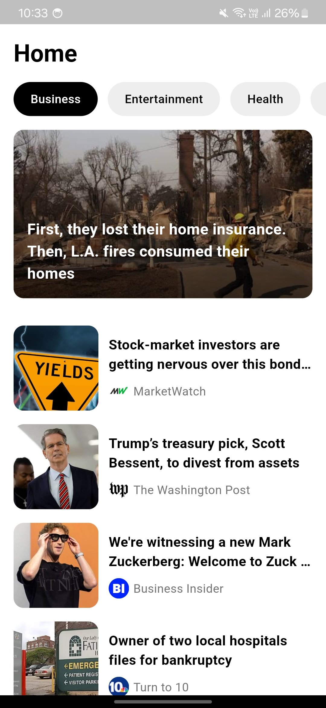

# News App

A **Flutter** application that displays the latest news from around the world. This app uses **GetX** for state management, ensuring a smooth and reactive user experience. The News App fetches articles from various sources and displays them in a user-friendly interface.

---

## Features

- **Real-time News Feed:** Stay up to date with the latest news.
- **Category Filtering:** Browse news by different categories such as Technology, Sports, Health, Business, and more.
- **Dark/Light Theme:** Toggle between dark and light mode for comfortable reading.
- **Pull-to-Refresh:** Easily refresh the news feed by swiping down.
- **Offline Mode:** Cached articles can be viewed even without an internet connection.

---

## Technologies Used

- **Flutter**: Cross-platform mobile app framework.
- **GetX**: Simple and powerful state management solution.
- **REST API**: Fetching news articles.
- **Dio**: For making HTTP requests.
- **Shared Preferences**: Storing user preferences like theme and category.

---

## Screenshots

### Some of the image of the ui



---

## Installation

1. Clone the repository:
   ```bash
   git clone https://github.com/yourusername/news-app.git
   ```
2. Navigate to the project directory:
   ```bash
   cd news-app
   ```
3. Install dependencies:
   ```bash
   flutter pub get
   ```
4. Run the app:
   ```bash
   flutter run
   ```

---

## Usage

1. Launch the app.
2. Browse the latest news on the home screen.
3. Use the category filter to view specific types of news.
4. Toggle between light and dark themes using the settings icon.

---

## API Integration

The app uses a public REST API to fetch the latest news articles. Replace the API key in the following file with your own:

```dart
const String apiKey = 'YOUR_API_KEY';
```

---

## Folder Structure

```
lib/
├── main.dart        # Entry point of the application
├── bindings/        # GetX bindings for dependency injection
├── controllers/     # GetX controllers for managing state
├── models/          # Data models for articles
├── services/        # Services for API calls
├── views/           # UI screens
├── widgets/         # Reusable widgets
```

---

## Contributing

Contributions are welcome! Please fork the repository and submit a pull request for any improvements or bug fixes.

---

## License

This project is licensed under the MIT License.

---

## Contact

For any inquiries or support, contact [thakuriumesh919@gmail.com](mailto:thakuriumesh919@gmail.com).

---

Happy Coding!

